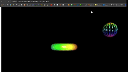

# 概要
トーラスを中心に二つの球体が回り、画面上のマウス方向に、カメラが移動したりトーラス表面が引っ張られたりします。  

## 開発目的
WebGLを使って、シェーダだからできる表現、オリジナルの表現を作ること。  
数学知識を活用した処理を実装すること。

## 使用言語
WebGL, HTML, CSS, JavaScript

## パラメータ説明
**MouseRole**  
ROTATION: マウス方向・原点中心でカメラが回転する設定  
TRANSFORM: マウス方向にトーラス表面が引っ張られる設定

**CameraGaze**  
0, 0, 0: カメラは常にトーラスを向く設定  
0, 0, -1000: カメラは常に奥を向く設定

## アピールポイント
マウスとのインタラクションに関する処理は、サイトを参考にすることなく1から作成しました。  
特に以下の2点がこだわりポイントです。  

**カメラ回転処理**  
Quaternionを使うことで、その時点までの回転情報を掛け算だけで保持でき、MouseRoleの変化に対応できるようにしました。  

**トーラス表面吸引**  
シェーダで避けるべき条件分岐をすることなく、表面が引っ張られる処理を実装するために、頂点の法線ベクトルとの内積をとる処理を行いました。

## 参考サイト
https://wgld.org/
